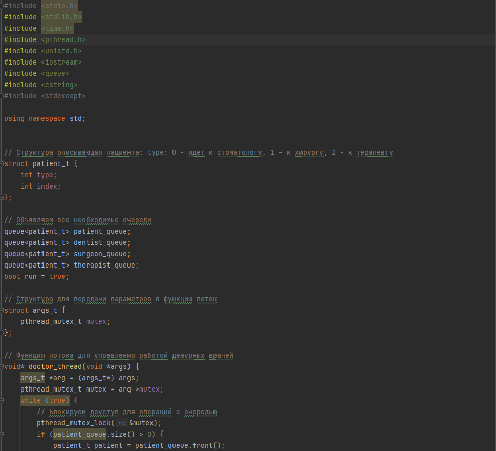
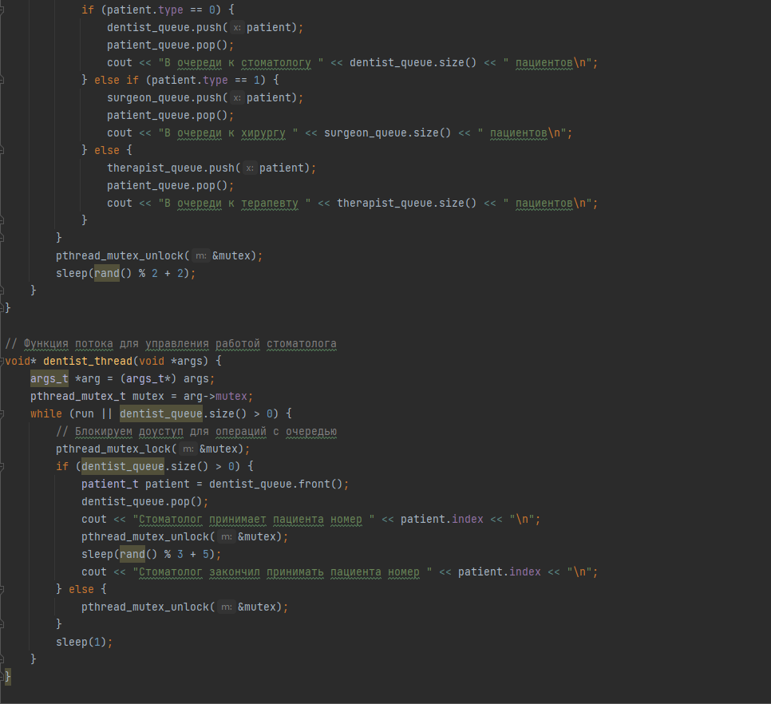
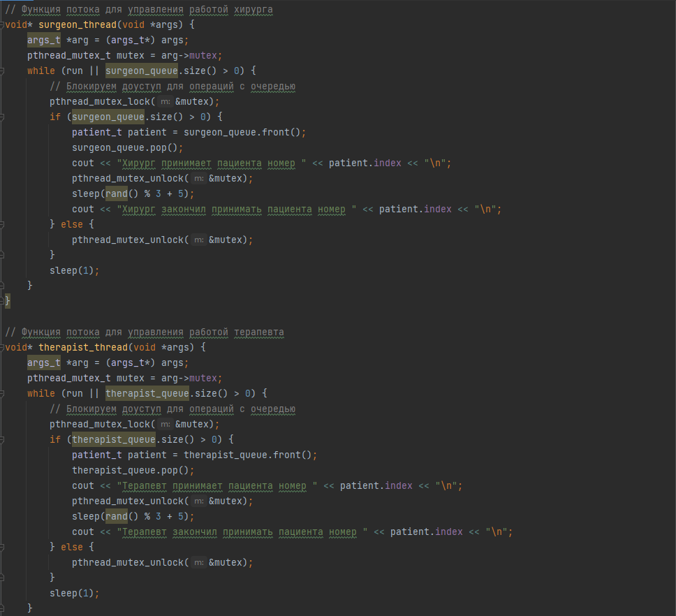
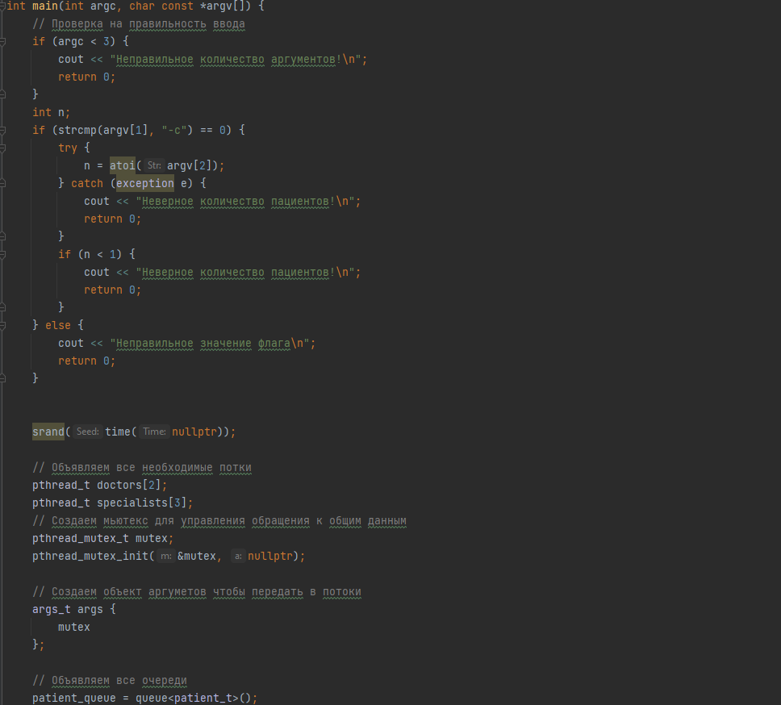
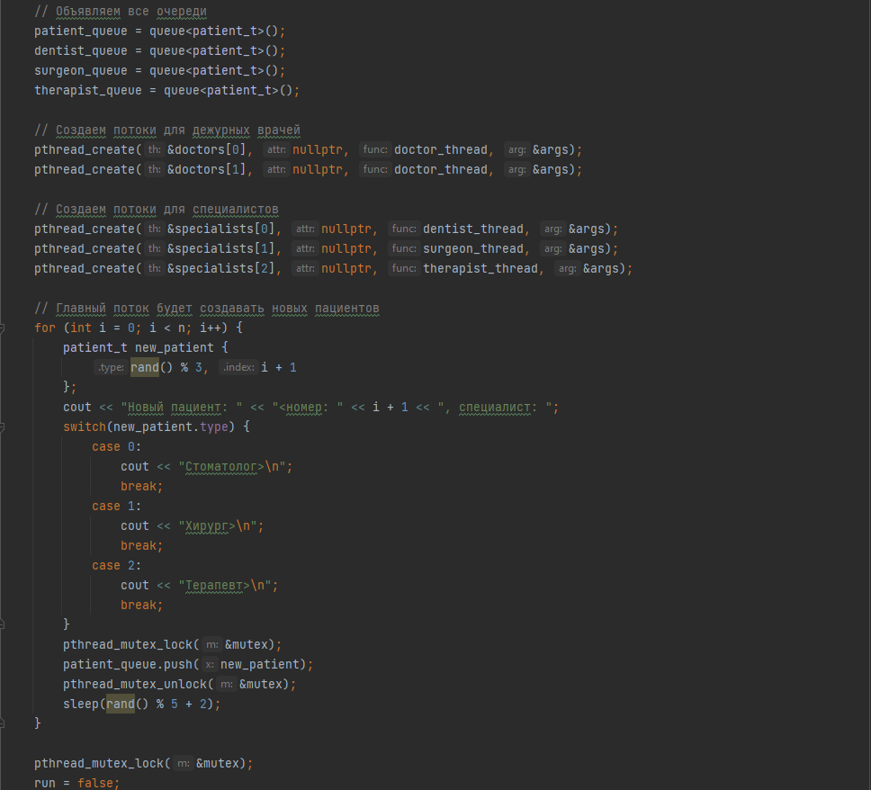
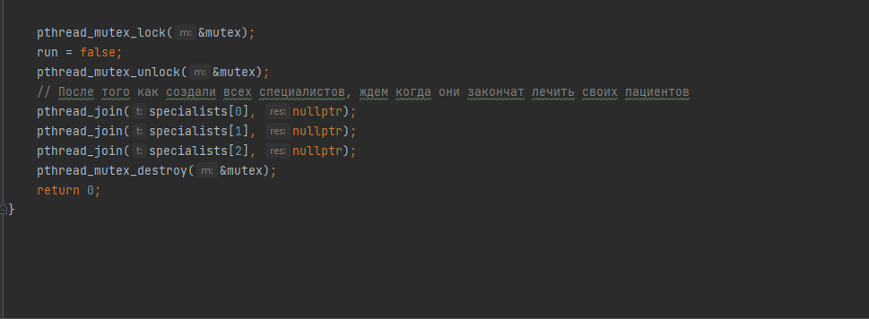

# Четвёртое индивидуальное задание по АВС
## Вариант 11, Ермолаев Глеб Олегович, БПИ216
### Задание:

Задача о больнице. В больнице два дежурных врача принимают пациентов, выслушивают их жалобы и отправляют или к стоматологу, или к хирургу, или к терапевту. Стоматолог, хирург и терапевт лечат пациентов. Каждый врач может принять только одного пациента за раз. Пациенты стоят в очереди к врачам и никогда их не покидают. Создать многопоточное приложение, моделирующее рабочий день клиники. 

На 5 баллов:













Команда для компиляции кода:
```
gcc main_6.cpp -o main -lpthread
./main -c <кол-во пациентов>
```

# Описание работы программы:
Создаем очередь для каждого врача. Объявляем потоки для каждого врача. После того, как пациент попал в очередь, поток ждёт гостя рандомное время (от 5 до 7 секунд).
